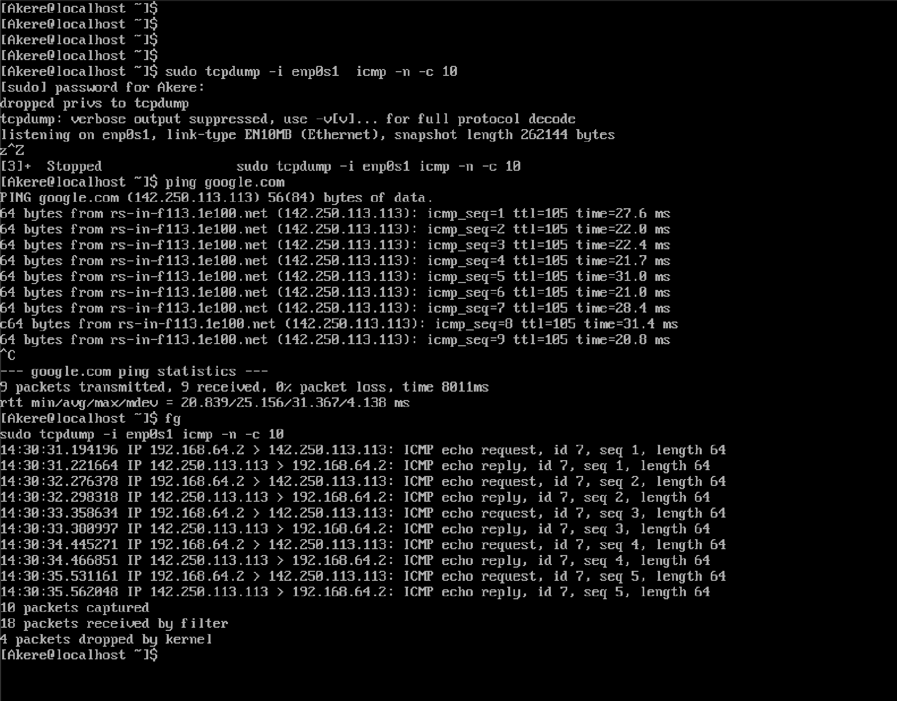
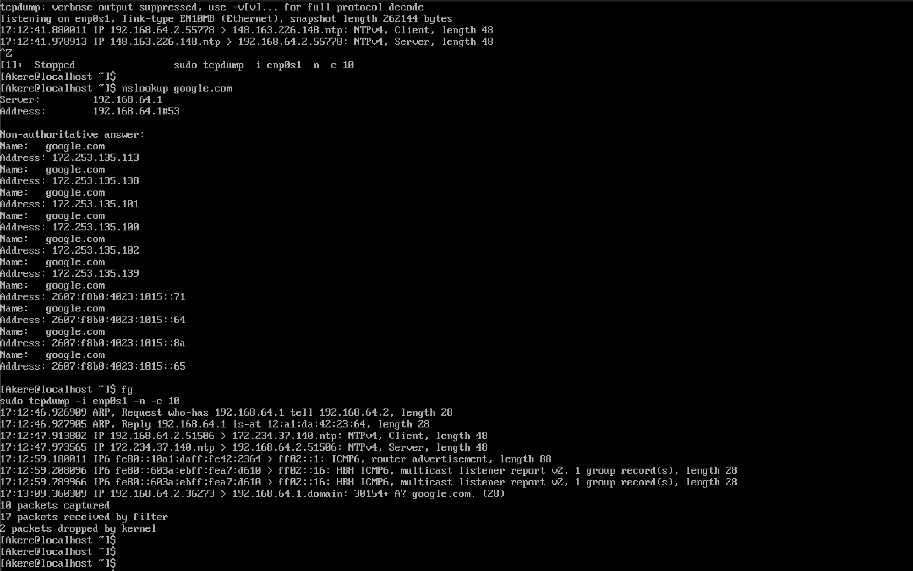

# Network Traffic Analysis Lab

## Overview

This project demonstrates how network traffic can be captured and analyzed using tcpdump on a Linux system. The lab focuses on identifying ICMP and DNS traffic generated from common network commands.

## Tools Used

- tcpdump
- Rocky Linux
- ping
- nslookup

## Objectives

- Capture live network traffic using tcpdump
- Identify ICMP traffic generated by ping
- Identify DNS traffic generated by nslookup
- Understand basic packet flow in a Linux environment

## Procedure

### ICMP Traffic Capture

ICMP traffic was captured using tcpdump while generating traffic with the ping command.

Commands used:

sudo tcpdump -i any icmp -n -c 10  
ping google.com  

Result:

- ICMP echo request packets were captured  
- ICMP echo reply packets were captured  
- Communication between the local machine and an external host was verified  

### DNS Traffic Capture

DNS traffic was captured using tcpdump while generating traffic with the nslookup command.

Commands used:

sudo tcpdump -i any -n -c 10  
nslookup google.com  

Result:

- DNS query traffic was captured  
- The configured DNS server was identified  
- Domain name resolution for google.com returned multiple IP addresses  

## Key Findings

- tcpdump can capture and display real-time network traffic from the command line  
- ICMP traffic shows request and reply behavior used for connectivity testing  
- DNS traffic demonstrates how domain names are translated into IP addresses  
- Packet capture tools provide visibility into network communication and troubleshooting  

## Notes

This lab demonstrates practical experience using tcpdump in a Linux environment to capture and analyze live network traffic. It highlights foundational networking concepts and reinforces understanding of protocol behavior.

